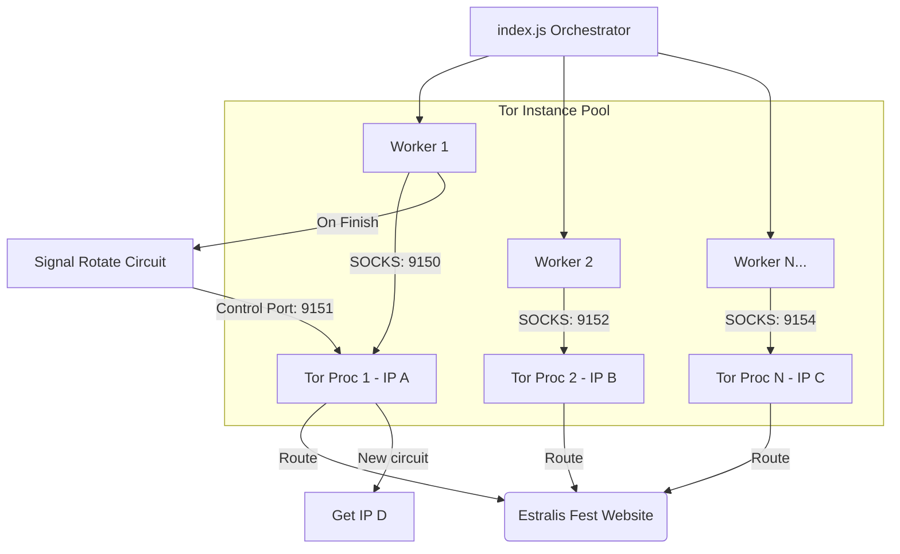

# Estralis Bot v2.0 — Comprehensive Execution Guide ⚡

Welcome to the operator's manual for the **Estralis Bot parallel automated registration system**. This guide details how to configure, run, and secure your bot fleet, access your telemetry dashboard from anywhere, and understand every configuration option.

---

## 🗺️ Quick Start: "What to Click First"

To get the bot and dashboard running on **Windows**, you have two main execution pathways:

### Pathway A: Git Bash (All-in-One Menu) — *Recommended*
If you have Git Bash installed (typically comes with Git for Windows):
1. **Open Git Bash** in your project folder (`c:/the tester/estralis-bot`).
2. Run the interactive menu script:
   ```bash
   ./run.sh
   ```
3. **First-Time Run:** If it's your first time, the script will automatically detect and execute **Option 9 (Full Setup)** to install Node dependencies, Tor, and Cloudflared.
4. **Choose Option 8 (All-in-One Mode):**
   * This launches the Dashboard, starts the Cloudflare Tunnel, and prompts you for the number of parallel workers.
   * Look for the link ending in `.trycloudflare.com` printed in the terminal.
   * Open this link on your phone/browser from anywhere!

---

### Pathway B: Standard Windows PowerShell (Manual Tabs)
If you are using a standard Windows PowerShell/CMD terminal, follow these step-by-step actions:

#### Step 1: Install Dependencies (Do once)
Open a terminal in the folder and run:
```powershell
npm run setup
```

#### Step 2: Launch the Live Dashboard
Open a new terminal tab and run:
```powershell
npm run dashboard
```
*This starts the monitoring database on http://localhost:4000.*

#### Step 3: Expose Dashboard to the Internet
Open another terminal tab and run:
```powershell
npm run tunnel
```
*Look for the public URL (e.g., `https://xxxx.trycloudflare.com`) in the logs. You can open this link on your mobile phone, tablet, or external laptop anywhere in the world!*

#### Step 4: Run the Bot Fleet
Start your parallel registrars in a final terminal tab:
```powershell
# Run with 10 parallel browser threads using Tor IP rotation
node index.js --parallel 10 --proxy tor
```

---

## 📊 Dashboard Access From Anywhere

By using **Cloudflare Tunnels** (via `cloudflared`), you do not need to deal with port forwarding, dynamic DNS, or firewall exceptions.

```
+--------------------+        +---------------------+        +--------------------+
|   Local Dashboard  | <----> |  Cloudflare Tunnel  | <----> |  Public Mobile     |
|   localhost:4000   |        |   *.trycloudflare   |        |  Browser (Anywhere)|
+--------------------+        +---------------------+        +--------------------+
```

### Is it Secure?
Yes, the setup incorporates the following security design:
1. **Read-Only Telemetry:** The stats, graphs, logs, and tables are read-only. Visitors cannot modify database state or inject code.
2. **Obscurity:** Trycloudflare URLs are randomized subdomains (e.g., `https://clinical-pennsylvania-surveillance-guarantee.trycloudflare.com`) that are extremely difficult to guess.
3. **Password-Protected Kill Switch:** 
   * If an emergency arises, the dashboard contains a **Kill Switch** button.
   * Clicking it displays a prompt requiring the passcode.
   * **The default passcode is:** `Gcem`
   * Once entered, it executes a clean shutdown of all active Playwright processes and shuts down the dashboard.

---

## ⚙️ Parallel Execution Mechanics

How does the bot scale safely up to massive counts without getting blocked or throttled?



1. **Unique Browsers:** Every worker thread spawned runs in an isolated `BrowserContext` with dedicated cache, cookies, and fingerprinting (e.g., simulated custom user agents and viewports).
2. **Dedicated Tor Instances:** When running with `--proxy tor`, the script spawns a dedicated Tor executable process for *each* parallel worker. If you select 10 workers, Tor launches 10 background processes on separate local SOCKS5 ports starting at `9150` (Control ports starting at `9151`).
3. **On-the-Fly Circuit Rotation:** Upon completing a registration, the orchestrator triggers a `rotateWorkerIP()` event. This connects to the specific control port of that worker's Tor process and issues a `signal newnym` command.
4. **Result:** Each parallel thread maintains a completely unique, constantly-rotating external IP address, successfully bypassing server rate-limiting and Cloudflare protection thresholds.

---

## 📝 Detailed Note on Script Run Options

Here is a short, concise description of every option available in the `./run.sh` menu:

| Option # | Option Title | Description |
| :--- | :--- | :--- |
| **`1`** | **Run ALL names + Tor (parallel)** | **[RECOMMENDED]** Reads all Indian names in `NAMES.TXT` and splits them into your chosen parallel worker count (e.g. 10 threads) with isolated Tor IP rotation per worker. Good for mass automated submission. |
| **`2`** | **Run custom count (parallel, no proxy)** | Runs a designated number of registrations (e.g., 50) using parallel threads, but routes directly through your local home network IP (no Tor/Proxy rotation). Useful for fast testing when IP bans are not a concern. |
| **`3`** | **Run with proxy list (proxies.txt)** | Routes your parallel browser threads through a list of custom proxy servers provided in `proxies.txt` instead of launching Tor instances. |
| **`4`** | **Run sequential (single thread)** | Runs a custom count of registrations one-by-one in a single thread. Good for diagnostic tests or low-resource virtual private servers. |
| **`5`** | **Run in background (VPS/nohup)** | Launches the mass parallel bot in background daemon mode (`nohup`), letting it run continuously even if you close your terminal or disconnect from a VPS. Progress is written silently to `/logs/bg_*.log`. |
| **`6`** | **Launch Dashboard (local)** | Spins up the real-time node HTTP web server on `http://localhost:4000`. Keeps the terminal open to monitor metrics locally. |
| **`7`** | **Launch Dashboard + Cloudflare Tunnel** | Starts the web server AND instantly opens a secure Cloudflare Tunnel, printing out a public `trycloudflare.com` URL to monitor the runs from any device. |
| **`8`** | **Run Bot + Dashboard + Tunnel (all-in-one)**| **[THE COMPLETE PACKAGE]** Fires up the telemetry server, establishes the public tunnel, waits for you to choose parallel worker counts, and launches the mass registrar bot concurrently. |
| **`9`** | **Full setup (Node + Tor + Tunnel)** | Automated installer script. Resolves all local operating system bindings, updates node packages, sets up Tor system services, and verifies playwright browser runtimes. |
| **`10`** | **Start / restart Tor** | Force-stops all local Tor process instances and triggers a clean reboot of the background Tor daemon SOCKS relay node. |
| **`11`** | **Check Tor IP** | Makes two requests to `ifconfig.me`—one directly from your machine and one routed through the local Tor proxy SOCKS port—displaying both external IPs side-by-side to verify Tor works. |
| **`12`** | **View live logs** | Spawns a real-time tail (`tail -f`) of the active run log file in your command line terminal. |
| **`13`** | **Stop all bots + dashboard** | Emergency cleanup utility. Force-kills any remaining Playwright browser nodes, dashboard server processes, or Cloudflare tunnels running on your machine. |
| **`0`** | **Exit** | Shuts down the interactive helper terminal environment. |

---

## 💡 Top Operating Tips
* **Memory Constraints:** Running 10-20 parallel browser contexts can consume substantial RAM (approx. 200MB-400MB per browser thread). Ensure your Windows machine has sufficient memory (8GB+ recommended) before executing high-concurrency rounds.
* **Tor Setup on Windows:** If Option 11 fails to verify a Tor IP, download the official **Tor Expert Bundle** or **Tor Browser**, launch it in the background, and confirm it's routing through SOCKS port `9050`.
* **Output Log:** Successfully processed entries are immediately written to `output.csv`. If a registration fails, it is recorded with the specific error message (e.g., "Timeout", "Selector Not Found") to let you audit and troubleshoot easily.
